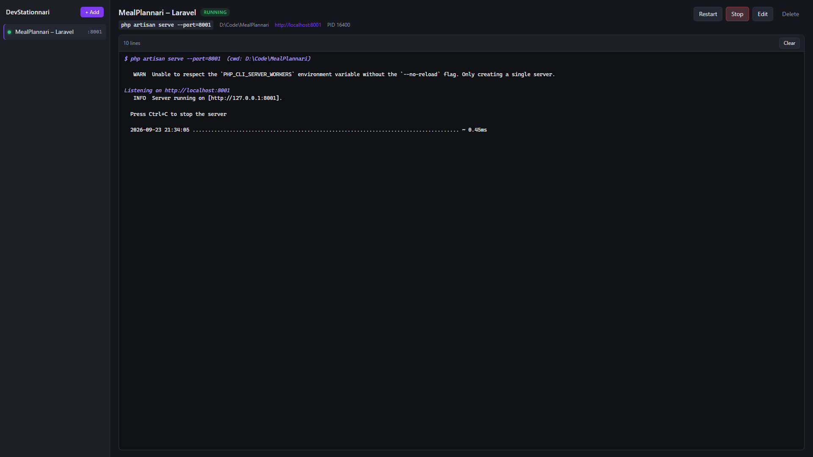
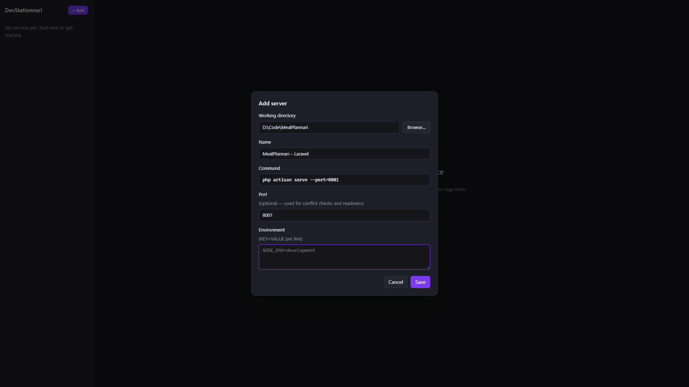
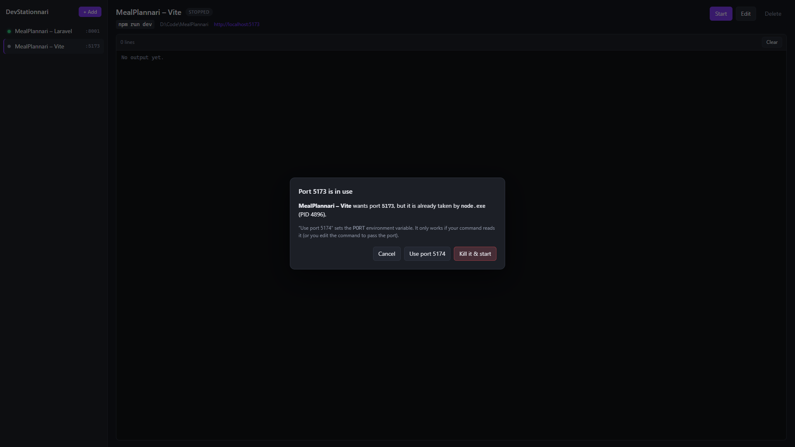

# DevStationnari

A lightweight desktop hub to start, stop and watch your local dev servers, whatever the framework.



- One-click start / stop / restart, with status (stopped · starting · running · crashed)
- Live stdout/stderr log viewer per server
- Port conflict detection: see which process holds the port, kill it, or use the next free port
- Kills the whole process tree (`npm run dev` → node → vite), and stops everything on quit
- Lives in the system tray: closing the window keeps servers running, and the tray menu can start, stop and open them

## Download

**Windows:** [download the latest installer](https://github.com/Narimene0Atmania/DevStationnari/releases/latest)
([v1.0.0 setup.exe](https://github.com/Narimene0Atmania/DevStationnari/releases/download/v1.0.0/devstationnari-1.0.0-setup.exe), 90 MB).

The installer isn't code-signed yet, so Windows SmartScreen may say "Windows protected your PC".
Click **More info → Run anyway**.

Built with Electron + React + TypeScript (electron-vite). Server definitions live in
`%APPDATA%/devstationnari/servers.json`.

## Screenshots

| Add a server                                          | Port already in use                                                                    |
| ----------------------------------------------------- | -------------------------------------------------------------------------------------- |
|  |  |

## How it works

- **Main process** (`src/main`) owns every child process. `serverManager.ts` spawns the
  command through the shell, streams its output into a bounded log buffer, and polls the
  configured port until something accepts a connection before it reports `running`.
- **Process-tree kill.** A dev command like `npm run dev` usually spawns a chain of
  children. On Windows the manager uses `taskkill /T /F`; on macOS and Linux each server
  runs in its own process group so one signal reaches the whole tree, with a SIGKILL
  fallback if SIGTERM is ignored.
- **Port checks** (`ports.ts`) bind the port on both IPv4 and IPv6, then ask `netstat` or
  `lsof` who is listening. That is how the conflict dialog can name the owning process.
- **Preload bridge** (`src/preload`) exposes a small typed API over IPC. The renderer runs
  sandboxed with context isolation and no Node access.
- **Renderer** (`src/renderer`) is a plain React app that subscribes to status and log
  events and never touches the OS directly.

**Ports.** Write `{port}` in the command wherever the port goes, e.g.
`npm run dev -- --port {port}` or `php artisan serve --port={port}`. The Port field fills it in,
and "use next free port" swaps in the new number. The `PORT` environment variable is set too,
which is enough for most Node servers. If a server ignores both and prints a different local
URL, the app notices, reports the real port, and warns you in the log instead of waiting on the
wrong one.

## Development

```bash
npm install
npm run dev        # launch with HMR
npm run typecheck
npm run lint
npm test
npm run build:win  # NSIS installer
```

CI runs typecheck, lint, tests, formatting and the build on every push.

One test, the SIGTERM-to-SIGKILL escalation in `serverManager.test.ts`, only applies to macOS
and Linux and is skipped on Windows, where processes are always force-killed.
